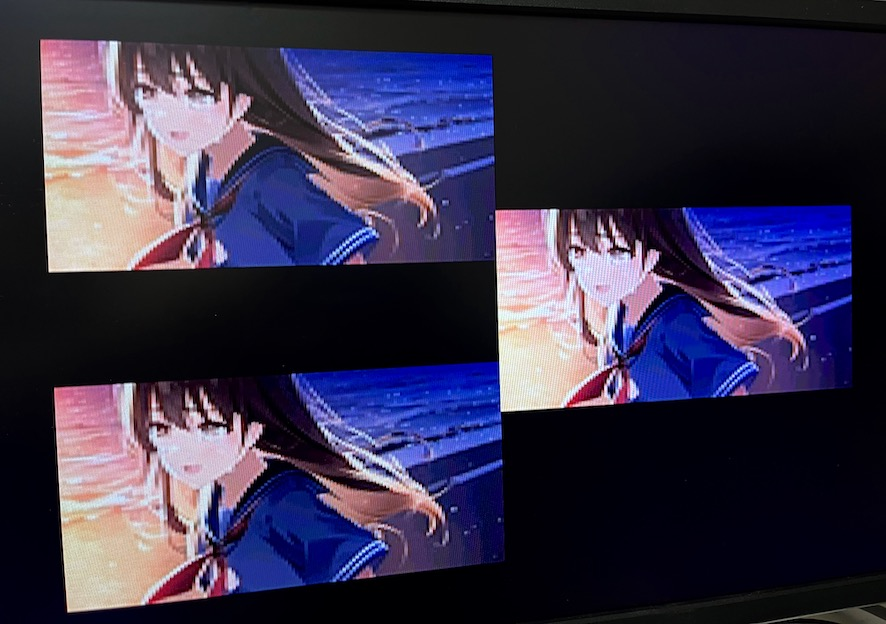

# HVDTP.X

A simple high memory VDT/V16 movie player for Human68k/X680x0

---

## About This

ハイメモリ専用のVDT/V16動画プレーヤです。

 - fpsを優先するため逐次読み込み再生ではなくすべてハイメモリに一括バッファ
 - 8つの表示モードをサポート (再生中にF1~F8で切り替え可能)
 - 15kHz/31kHzモード両対応
 - リピート再生対応 
 - PCMドライバとしてPCM8A.X / PCM8PP.X を使用

当時物のVDT/V16プレーヤーソフトはPhantomXライトバックモードで正常に動作しないものが多いのと、当時存在し得なかったハイメモリフルバッファリングでの再生を試してみたかったので作成しました。

なお、ポスター画像(サムネイル画像)表示には対応していません。圧縮形式VDTにも対応していません。
拙作 [MCSEL.X](https://github.com/tantanGH/mcsel) と組み合わせての利用を推奨します。

---

## 動作環境

* PhantomX 1.03d ライトバックモード推奨
* 68030モード ハイメモリ768MB推奨
* TS16DRVp.X ハイメモリドライバ
* VDISK必須 (HDS非対応)
* MercuryUnit 推奨

注意：PhantomX 1.03e ではグラフィックVRAMにゴミ(白ドット)が出る場合があります。1.03dを推奨します。

注意：ライトバックモードで再生が停止してしまうケースがある報告を頂いています。その場合はライトスルーモードを試して見ください。

---

## 使い方

PCM8A.X または PCM8PP.X をあらかじめ常駐させておきます。

        usage: hvdtp [options] <movie-file(.vdt|.v16)>
        options:
              -l[n]         ... リピート回数指定。数字省略で無限リピート。(0:endless, 1:default)
              -s<1-8>       ... 画面表示モード (1:default)
              -c<15|31>     ... 15/31kHz mode (31:default)
              -q            ... quiet mode
              -h            ... show help message

注意：-c15で水平15kHzモードにした場合、再生がより滑らかになりますが、MercuryUnitで48kHzのデータを再生した場合にノイズが乗ることがあります。32kHz音声の場合は問題ありません。

---

## 画面表示モード

1 ... 中央に128x120のサイズで表示します。

2 ... 左上と右下に128x120のサイズで表示します。

3 ... 右上と左下に128x120のサイズで表示します。

4 ... 左上と右と左下に128x80のサイズで表示します。

5 ... 左上、右上、左下、右下に128x60のサイズで表示します。

6 ... 256x240に拡大して1ライン飛ばして表示します。

7 ... 256x120のサイズで表示します。

8 ... 256x240のサイズで表示します。

再生中にF1~F8で切り替えることもできます。一部のモードで画像クロップされるのは PhantomX(RP4B) + S32 + 30fps でコマ落ち無し再生できる限界付近を狙って調整しているためです。ただしF8モードではそれでもコマ落ちします。

---

## 環境変数

環境変数 `HVDTP_OPTS` にコマンドラインオプションをあらかじめ設定しておくことが可能です。

例: `SET HVDTP_OPTS=-c15 -s4`

この場合水平15kHzモード、画面モード4で起動するようになります。MCSEL.Xと組み合わせる場合などに活用できます。

---

## 060turbo実機で使う場合

基本的に PhantomX + VDISK を念頭に設計・実装されていますが、060turbo実機でも制約付きながら利用可能です。

* SCSI HDDからハイメモリへダイレクトロードするために TS16FILE.X の常駐が必要
* 060turboのハイメモリ上限(128MB)までに収まるファイルのみ再生可能

MercuryUnit V3と組み合わせて 44.1kHz ステレオ 30FPS のV16再生がコマ落ち無くできることは確認しました。

---

## VDT/V16データ作成方法

当時物のデータ以外に新規作成する場合は拙作 [xmkvdt](http://github.com/tantanGH/xmkvdt/) などが使えます。
ただ、要Python環境の上に、全くドキュメント書いてませんが...

---

## History

* 0.3.6 (2023/11/18) ... 内蔵ADPCM音声が正常に鳴らなくなっていたのを修正。
* 0.3.5 (2023/11/18) ... PCM8Aの動作モードを変更しないようにした。
* 0.3.4 (2023/11/16) ... 環境変数 HVDTP_OPTS に対応した。
* 0.3.3 (2023/11/16) ... デフォルトで水平31kHzモードにした。VSYNC割り込み中のDMAC割り込みを許可した。
* 0.3.2 (2023/11/14) ... コメントを表示するようにした。pcm8ppの再生周波数をデータに合わせて制御するようにした。
* 0.3.1 (2023/11/13) ... 画面モード追加変更
* 0.3.0 (2023/11/12) ... 初版
